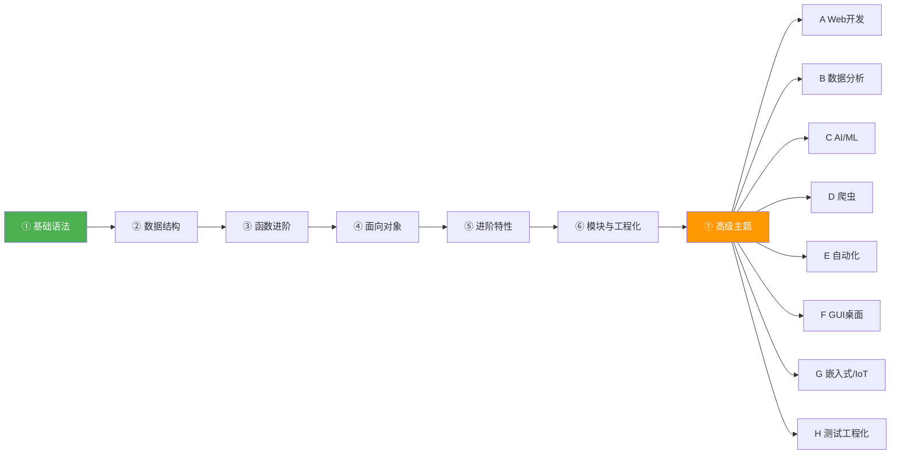

# Python 学习路线 · 从基础到分块方向

> [!info] 这是什么
> 这是一套面向 **完全零基础** 学习者的 Python 系统教程，共 7 个递进阶段 + 8 个应用方向。
> 按顺序学习 ①→⑦，每阶段完成后用自检清单确认，再进入下一阶段。

---

## 📊 七阶段核心进阶（按顺序学）

| 阶段 | 笔记 | 核心内容 | 预计耗时 |
|------|------|----------|----------|
| ① | [[01 基础语法]] | 变量 / 运算 / 控制流 / 输入输出 | 1~2 周 |
| ② | [[02 数据结构]] | list / tuple / dict / set / 推导式 | 1~2 周 |
| ③ | [[03 函数进阶]] | 参数 / 作用域 / lambda / 递归 | 1 周 |
| ④ | [[04 面向对象]] | 类 / 封装 / 继承 / 魔术方法 | 2 周 |
| ⑤ | [[05 进阶特性]] | 装饰器 / 生成器 / 迭代器 / 异常 | 1~2 周 |
| ⑥ | [[06 模块与工程化]] | 包管理 / 标准库 / pip / venv | 1 周 |
| ⑦ | [[07 高级主题]] | 并发 / 网络 / 内存管理 / 类型注解 | 持续 |

---

## 🗺️ 学习路线图

---

## 🧭 八大应用方向（地基稳后按需选择）

| 方向 | 代表技术栈 | 能做什么 | 入门难度 |
|------|-----------|----------|----------|
| A Web 开发 | Flask / FastAPI / Django | 后端 API、网站、管理后台 | 中 |
| B 数据分析 | NumPy、Pandas、Matplotlib | 数据清洗、报表、可视化 | 中 |
| C AI / 机器学习 | PyTorch、Scikit-learn | 模型训练、预测、图像/NLP | 高 |
| D 爬虫采集 | requests、Scrapy、Selenium | 批量抓取网页数据 | 中 |
| E 自动化工具 | os/subprocess、shutil | 批量改文件、定时任务 | 低 |
| F GUI 桌面 | PyQt/PySide、tkinter | 带界面的桌面工具 | 中 |
| G 嵌入式 / IoT | MicroPython、pyserial | 单片机编程、串口通信 | 中 |
| H 测试工程化 | pytest、black、CI | 单元测试、代码规范 | 低 |

---

## 📌 落地建议

- **地基优先**：①→⑦ 顺序学，别跳阶段
- **方向纵深**：地基稳后选 1~2 个应用方向深入
- **项目驱动**：用真实项目反向带动高级主题学习

---

## 📂 笔记导航

- [[01 基础语法]] — 变量、类型、运算符、字符串、控制流、函数入门
- [[02 数据结构]] — list/tuple/dict/set、推导式、切片、可变与不可变
- [[03 函数进阶]] — *args/**kwargs、LEGB作用域、闭包、lambda、递归、高阶函数
- [[04 面向对象]] — 类与对象、封装、继承、多态、魔术方法、抽象类
- [[05 进阶特性]] — 装饰器、生成器、迭代器、上下文管理器、异常处理
- [[06 模块与工程化]] — 模块/包、标准库、pip、虚拟环境、项目结构、pytest
- [[07 高级主题]] — 多线程/多进程/asyncio、网络编程、正则、内存管理、元类、类型注解

---

## 🔗 相关标签

#python #python/基础语法 #python/数据结构 #python/函数 #python/OOP #python/进阶特性 #python/工程化 #python/高级主题
